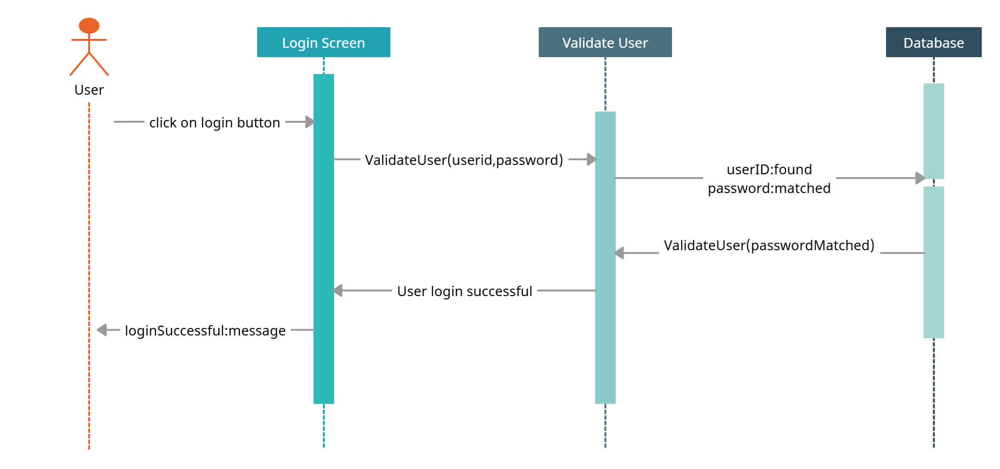
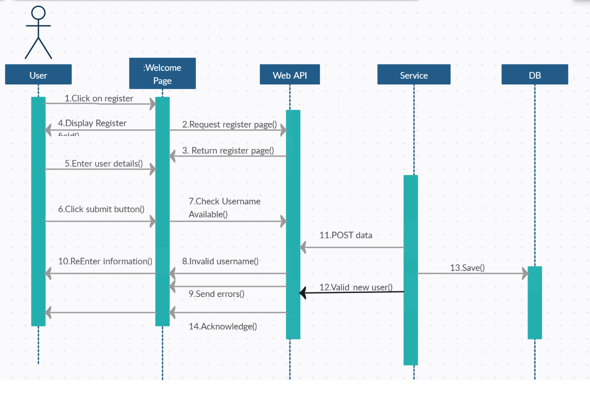
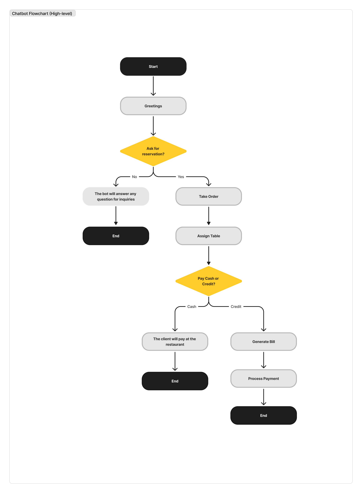
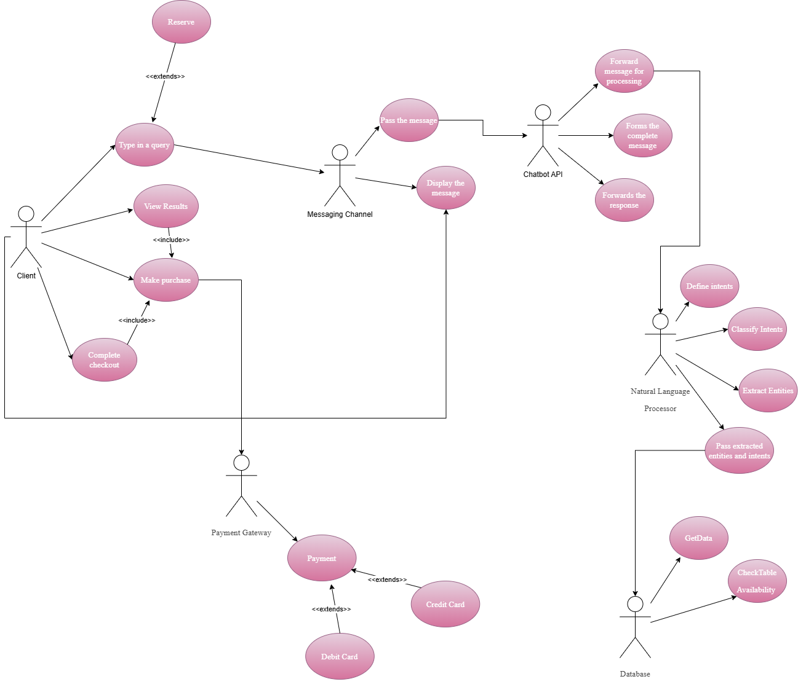
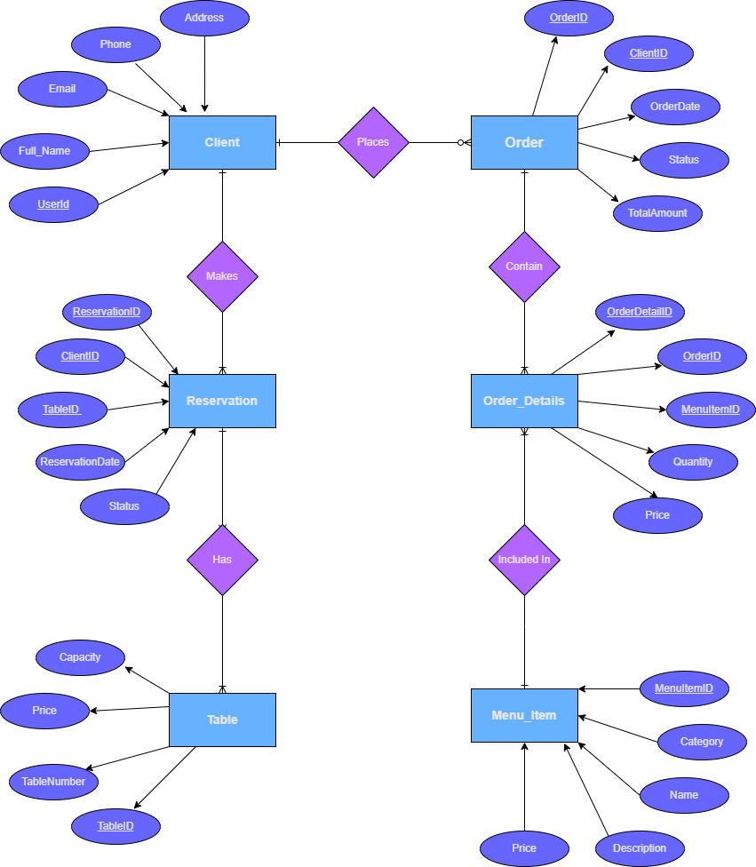

# 🛒 CashierBot for Restaurants

An AI-powered chatbot built with **Rasa** to streamline order placement, table reservations, and menu browsing for restaurants. Designed to handle customer interactions smoothly and efficiently, this bot uses natural language understanding (NLU) to provide a seamless user experience.

---


## 📹 Demo

> Check out the application in action!

---

## 🔄 System Flows

### 1. Login and Registration Flow



### 2. Chatbot Flowchart


### 3. Chatbot Use Cases


### 4. Database Design


---

## 📋 Features

- **Order Management**:
  - Place food orders with custom quantities.
  - Handles multiple items in a single order.
  - Tracks menu items for accurate order processing.

- **Table Reservations**:
  - Reserve tables directly through the chatbot.
  - Ensures real-time table availability.

- **Menu Display**:
  - Allows customers to browse the menu upon request.
  - Provides quick access to restaurant offerings.

- **Form-Based Slot Filling**:
  - Dynamically collects required information such as menu items, quantities, and table numbers.

---

## 🛠️ Technology Stack

- **Rasa**: Framework for natural language understanding and dialogue management.
- **Python**: For creating custom actions and logic.
- **Firebase**: For the database.
- **YAML**: For defining intents, entities, slots, and stories.
- **Docker** (optional): To containerize and deploy the chatbot.

---


## 🚀 Installation and Setup

### Clone the Repository:
```bash
git clone https://github.com/abdullah-khaled0/CashierBot-with-Rasa-open-source.git
cd cashierBotForRestaurant
```

### Set Up a Python Virtual Environment:
```bash
python -m venv venv
source venv/bin/activate  # On Windows: venv\Scripts\activate
```


### Install Dependencies:
```bash
pip install -r requirements.txt
```


### Run commands file (shell):
```bash
commands.bat
```
